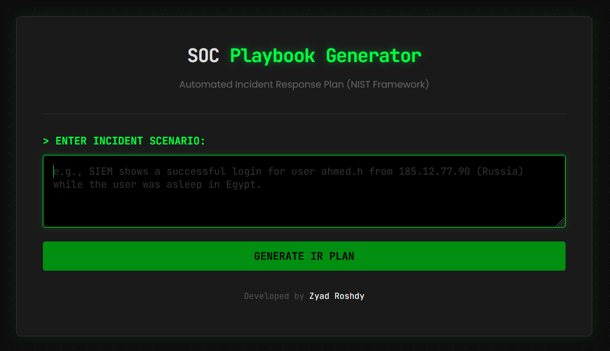
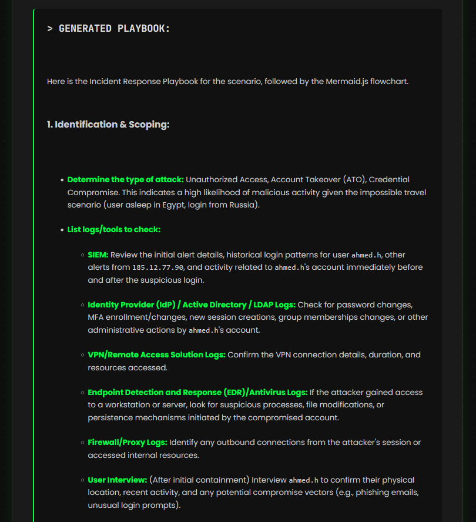
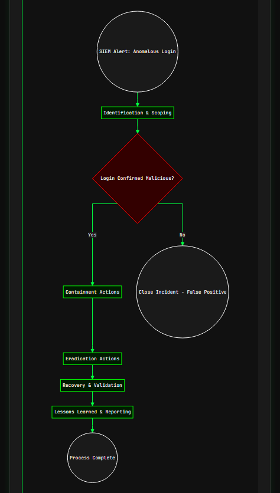

# 🛡️ AI-Powered SOC Playbook Generator


## 📌 Overview
This project is an automated **Incident Response (IR) Assistant** designed to help SOC Analysts reduce time-to-response. 

Leveraging **Google Gemini 2.5 Pro** and **Prompt Engineering**, the tool analyzes raw security alerts or scenarios and instantly generates:
1.  A full **NIST-Compliant Incident Response Playbook** (Identification, Containment, Eradication, Recovery, Lessons Learned).
2.  A dynamic, visual **Flowchart** (using Mermaid.js) to map out the investigation and decision-making process.

## 🚀 Key Features
* **🤖 AI-Driven Analysis:** Uses Large Language Models (LLM) to understand complex security scenarios.
* **📋 NIST Framework Alignment:** Ensures all generated playbooks follow industry-standard IR lifecycles.
* **📊 Automated Visualization:** Converts text-based logic into professional flowcharts automatically.
* **🌑 Cyberpunk UI:** A dark-themed, SOC-optimized interface built with HTML/CSS.

## 📸 Screenshots
| Incident Input | Generated Playbook | Visual Flowchart |
|:---:|:---:|:---:|
|  |  |  |

## 🛠️ Tech Stack
* **Backend:** Python, Flask
* **AI Engine:** Google Generative AI (Gemini 2.5 Pro)
* **Frontend:** HTML5, CSS3 (Custom Dark Theme), JavaScript
* **Visualization:** Mermaid.js
* **Data Processing:** Markdown library for Python

## ⚙️ Installation & Setup
1.  **Get the Project:**
    * **Download:** Click the green **Code** button above, select **Download ZIP**, and extract the folder.
    * **OR Clone:**
        ```bash
        git clone [https://github.com/ZyadRoshdy/SOC-Playbook-Generator.git](https://github.com/ZyadRoshdy/SOC-Playbook-Generator.git)
        ```

2.  **Install Libraries:**
    Open your terminal (CMD) and run the following commands to install the necessary tools:
    ```bash
    pip install flask
    pip install google-generativeai
    pip install markdown
    ```

3.  **Configure API Key:**
    * Get your free API key from [Google AI Studio](https://aistudio.google.com/).
    * Open the `main.py` file and replace the placeholder with your key.
    ```python
    genai.configure(api_key="YOUR_API_KEY_HERE")
    ```

4.  **Run the Application:**
    In the terminal, make sure you are inside the project folder, then run:
    ```bash
    python main.py
    ```
    Or you can run the file main.py in Visual Studio Code instead.

5.  **Start Using:**
    Open your browser and go to: `http://127.0.0.1:5000`

    **Note:** if any error appears after clicking "GENERATE IR PLAN", you may need to change the model to gemini-2.5-flash
    > main.py file > line 9 > make it like this:
    ```bash
    model = genai.GenerativeModel("models/gemini-2.5-flash")
    ```

## 🧠 How It Works (The Logic)
1.  **Input:** The user inputs a security scenario (e.g., "Employee at 192.168.20.33 clicked a phishing link and entered their credentials on 45.87.220.11").
2.  **System Prompting:** The backend sends a structured prompt to Gemini 2.5 Pro, acting as a "Senior Incident Responder."
3.  **Processing:** * The model generates the text response in Markdown.
    * It constructs a `Mermaid.js` graph code based on strictly defined classes (Decision diamonds, Process rectangles).
4.  **Sanitization:** A custom JavaScript function parses the raw AI output, fixes HTML entity encoding issues (like `&gt;` vs `>`), and renders the diagram.
5.  **Output:** A clean, formatted report + flowchart is displayed.

## 👤 Author
**Zyad Roshdy**
* **Role:** SOC Analyst | Cybersecurity Engineer
* **LinkedIn:** https://www.linkedin.com/in/zyad-roshdy

---
*Made with ❤️ for the Blue Team Community.*
